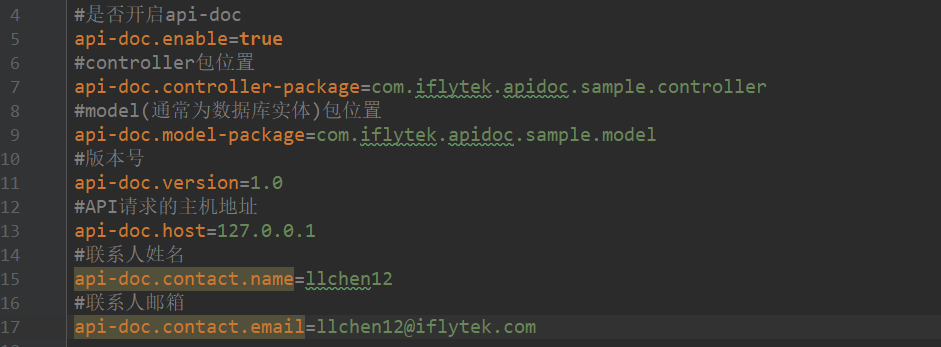
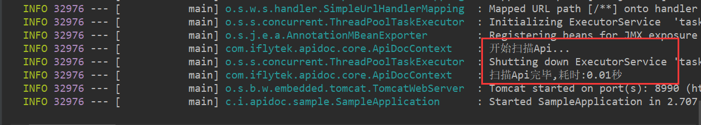
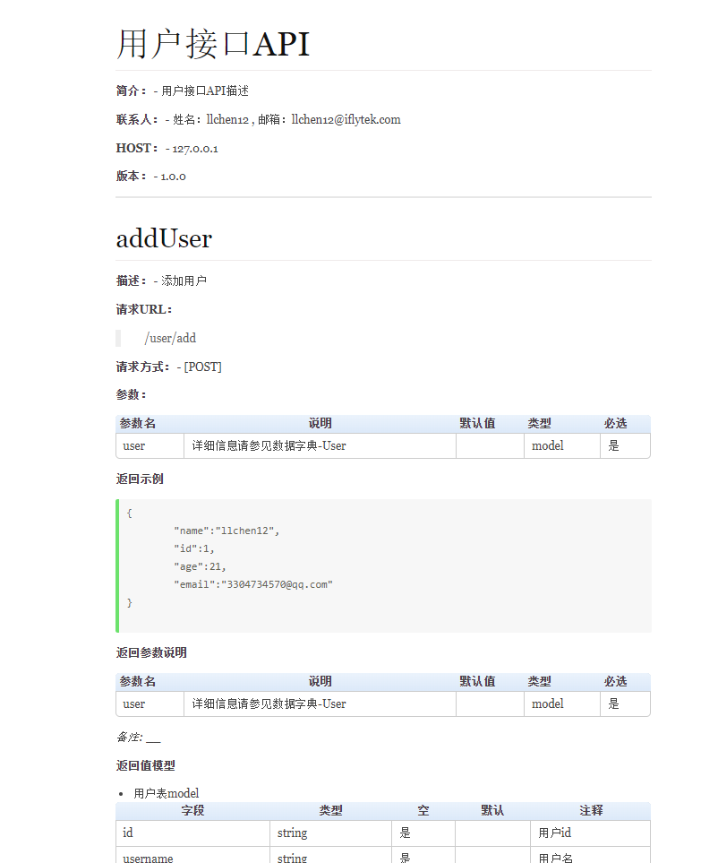
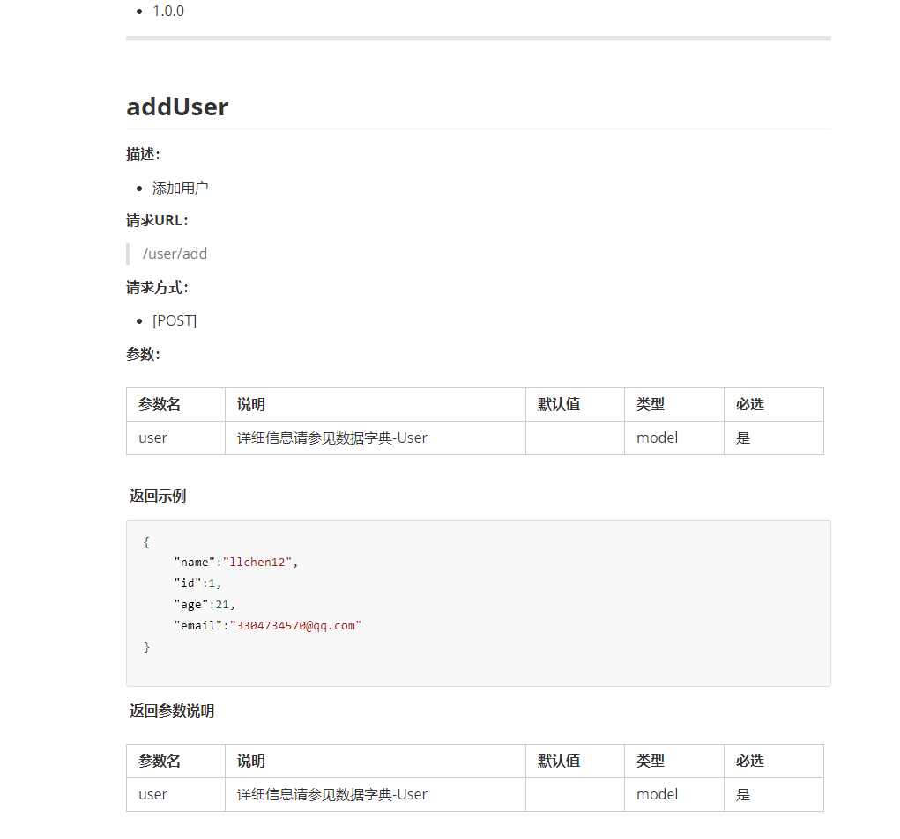

# API-DOC

## 介绍
api-doc是一个文档自动生成的工具，致力于减轻程序员撰写文档的烦恼。自动化配置，完美融合SpringBoot框架，可在线预览文档，也可以下载markdown格式的文档，后期慢慢加入在线调试的功能。

## 使用
api-doc的使用非常简单，与SpringBoot无缝集成。只需在spring的配置文件`application.properties`配置应用几个基本信息即可。

### 第一步：引入maven依赖

#### 1、使用maven从源码安装
clone项目代码
> git clone https://github.com/iloveruning/api-doc.git

进入项目
> cd api-doc

安装到本地仓库
> mvn clean install

#### 2、在pom.xml中添加依赖

```
  <dependency>
      <groupId>io.github.llchen</groupId>
      <artifactId>api-doc</artifactId>
      <version>0.1.0</version>
  </dependency>
```

### 第二步：修改配置文件 `application.properties`




### 第三步：具体使用
**在controller类上中使用注解`@ApiDoc`，在方法上使用注解`@Api`。**

``` java
@ApiDoc(name = "用户接口API", description = "用户接口API描述", version = "1.0.0",
        codes = {@ApiCode(code = "200", description = "success"), @ApiCode(code = "400", description = "fail")})
@Controller
@RequestMapping("/user")
public class UserController {

    private static ConcurrentHashMap<String, User> userMap = new ConcurrentHashMap<>();

    private static AtomicInteger idCount=new AtomicInteger(0);


    @Api(description = "通过id获取用户信息",
            requestParams = {@ApiParam(name = "id", description = "用户id", required = true)},
            demoResponse = "{\n" +
                    "\"name\": \"llchen12\",\n" +
                    "\"age\": 12,\n" +
                    "\"id\": \"123\",\n" +
                    "\"email\": \"3304734570@qq.com\"\n" +
                    "}",
            resultModel = User.class,remark = "这是备注")
    @GetMapping("/{id}")
    public User getUserById(@PathVariable("id") String id) {
        return userMap.get(id);
    }


    @Api(description = "添加用户",demoResponse = "{ \"id\": 1, \"name\": \"llchen12\", \"age\": 21, \"email\": \"3304734570@qq.com\" }")
    @PostMapping("/add")
    public User addUser(@RequestBody User user){
        user.setId(String.valueOf(idCount.incrementAndGet()));
        userMap.put(user.getId(),user);
        return user;
    }
}
```


**在model类上中使用注解`@ApiModel`，在属性上使用注解`@ApiModelProperty`。**


``` java
@Data
@ApiModel(description = "用户表model")
public class User {

    @ApiModelProperty(name = "id",description = "用户id",required = true)
    private String id;
    @ApiModelProperty(name = "username",description = "用户名",required = true)
    private String username;
    @ApiModelProperty(name = "password",description = "密码",required = true)
    private String password;
    @ApiModelProperty(name = "age",description = "年龄",required = false,type = DataType.INT)
    private Integer age;
    @ApiModelProperty(name = "email",description = "邮箱",required = true)
    private String email;
}
```

完成以上步骤后，我们就可以启动应用啦！





这时候可以访问`http://host:port/api/html`，会看到生成的api文档预览页面



访问`http://host:port/api/markdown`，可以下载markdown格式的文档




# 注解详细介绍
共有6个注解，标注整个文档信息。
- ApiDoc 标注API文档的基本信息
- Api 描述某一个api
- ApiParam 请求和响应的参数描述
- ApiCode 响应码（错误码）描述
- ApiModel 数据字典（model）描述
- ApiModelProperty model属性描述

## 详细介绍如下

@ApiDoc:写在类上，表示这是一个API文档
属性：

``` java
@Target(ElementType.TYPE)
@Retention(RetentionPolicy.RUNTIME)
@Inherited
public @interface ApiDoc {

    /**
     *文档名称
     */
    String name();

    /**
     * api描述
     */
    String description() default "";

    /**
     *api基本path
     */
    String basePath() default "";

    /**
     *文档版本
     */
    String version() default "";

    /**
     * 响应码
     */
    ApiCode[] codes() default {};
}
```

@Api:写在方法上，描述一个具体接口的信息
属性：

``` java
@Retention(RetentionPolicy.RUNTIME)
@Target(ElementType.METHOD)
@Documented
public @interface Api {


    /**
     *接口名字
     */
    String name() default "";

    /**
     *请求URL
     */
    String path() default "";

    /**
     * 描述
     */
    String description() default "";


    /**
     * 备注
     */
    String remark() default "";


    /**
     * http请求方式
     */
    String[] httpMethod() default {};


    /**
     * 请求参数
     */
    ApiParam[] requestParams() default {};


    /**
     *返回示例
     */
    String demoResponse() default "";


    /**
     * 返回参数
     */
    ApiParam[] responseParams() default {};


    /**
     *返回值模型
     */
    Class<?> resultModel() default Void.class;

}
```

@ApiParam: 写在注解内,描述请求和响应的参数
属性：

``` java
@Retention(RetentionPolicy.RUNTIME)
@Target(ElementType.FIELD)
@Documented
public @interface ApiParam {

    /**
     * 参数名
     */
    String name();

    /**
     * 参数说明
     */
    String description();


    /**
     * 默认值
     */
    String defaultValue() default "";

    /**
     * 是否必选
     */
    boolean required() default false;

    /**
     * 示例
     */
    String example() default "";

    /**
     * 数据类型
     */
    DataType type() default DataType.STRING;
}

```

@ApiCode: 写在注解内，描述响应码
属性：

``` java
@Target(ElementType.FIELD)
@Retention(RetentionPolicy.RUNTIME)
@Inherited
public @interface ApiCode {

    /**
     * 错误码
     */
    String code();

    /**
     * 错误解释
     */
    String description();
}
```

@ApiModel: 写在类上，描述一个model的基本信息
属性：

``` java
@Target(ElementType.TYPE)
@Retention(RetentionPolicy.RUNTIME)
@Inherited
public @interface ApiModel {

    /**
     * 数据模型描述
     */
    String description() default "";

    /**
     * 备注
     */
    String remark() default "";

}
```

@ApiModelProperty: 写在属性上，描述model属性的信息
属性：

``` java
@Retention(RetentionPolicy.RUNTIME)
@Target(ElementType.FIELD)
@Documented
public @interface ApiModelProperty {

    /**
     * 参数名
     */
    String name();

    /**
     * 参数说明
     */
    String description();


    /**
     * 默认值
     */
    String defaultValue() default "";

    /**
     * 是否必选
     */
    boolean required() default false;

    /**
     * 示例
     */
    String example() default "";

    /**
     * 数据类型
     */
    DataType type() default DataType.STRING;
}

```

# 支持和反馈

由于每个人写代码的习惯可能都不一样，虽然已经尽可能考虑到了多种不同的情况，但由于作者本人的认知和精力有限，难免会疏忽或者本身就存在有 bug 的情况，如果你在使用的过程中有碰到困难或者疑问，欢迎提issue

如果你觉得这个项目对你有用，不妨给个⭐star。

你的支持是我前进的动力！
